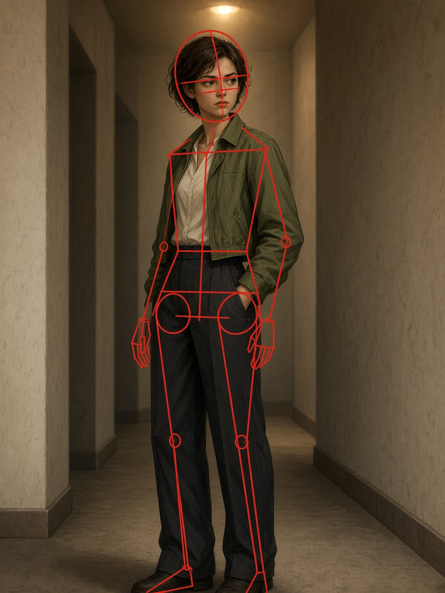

# Rozan

Construction overlays for drawing. Face landmarks, Loomis, pose, and hands.



The image dataset is **private** and is not in this repository.

| Colab | Script | What it did |
| --- | --- | --- |
| `rozan-m.ipynb` | `anatomy_overlay.py` | MediaPipe face + pose + hands (torso box, hip circles, hand cards) |
| `rozan-f1.ipynb` | `face_landmarks.py` | Face Landmarker dots |
| `rozan.ipynb` | `fix_labels.py`, `train_pose.py` | YOLO 86-keypoint train v1–v4, label cleanup |
| `rozan2.ipynb` | `train_pose.py` | Later YOLO runs + Loomis from YOLO keypoints |

```bash
pip install -r requirements.txt
```

```bash
python anatomy_overlay.py --input path/to/images --output path/to/out
python face_landmarks.py --input path/to/images --output path/to/out
python fix_labels.py --train path/to/labels/train --val path/to/labels/val
python train_pose.py --data path/to/data.yaml
```

Models download on first MediaPipe run into `models/`. The Flutter app is not in this repo.
